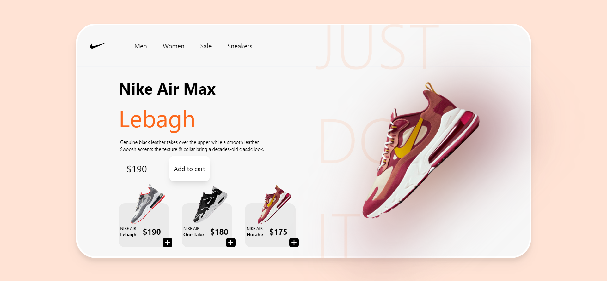

# Nike Website UI

### Overview

This SPA was developed using React, HTML and Tailwind CSS. A simple project, it uses one useState hook to display the shoe which has been clicked. The image data is fetched when the shoe item gets clicked, and the same is passed to the parent component so that the bigger image of the shoe is rendered. Moreover, the entire page has been divided into reusable components. 

### Constraints

- The website is not responsive. 
- The number of functionalities can be increased.
- The website is not an exact replica of the original design although a lot of elements have been retained & resued.

### Improvements

- The page can be made responsive using Tailwind CSS grids, or restyling the entire page using Bootstrap.
- Functionalities like displaying mens, womens shoes separately can be implemented.

### UI Credits

Many thanks to **Nikhil Pawar** and his [amazing UI design tutorial](https://www.youtube.com/watch?v=_gX-lwyMLwI) for making the Figma file available to all.

